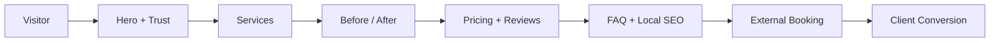

<p align="center">
  
</p>

# Sekrety
### Beauty Website Research + Conversion Blueprint

> **Audyt rynku beauty zamieniony w techniczną specyfikację strony, która prowadzi od wejścia do rezerwacji.**

`NEXT.JS` `BOOKING` `LOCAL SEO` `BEFORE / AFTER` `SOCIAL PROOF` `MOBILE FIRST`

---

## System in one view



## Co jest w tym repo

Repo zawiera rozbudowany audyt polskich i światowych stron beauty oraz specyfikację wdrożeniową opartą o realne wzorce: booking CTA, usługi problem→rozwiązanie, before/after, personal brand, cennik, testimonials, FAQ, local SEO i NAP.

Warstwa aplikacyjna deklaruje stack Next.js / React / TypeScript / Tailwind / Prisma w `package.json`. **Kompletność działającej aplikacji nie została w tym README passie ponownie zweryfikowana.**

## Blueprint

Specyfikacja wskazuje 10 kluczowych sekcji:

1. sticky header + booking CTA,
2. hero + 3 usługi flagowe,
3. social proof / awards / counters,
4. usługi problem→rozwiązanie,
5. before/after gallery,
6. personal story właścicielki/studia,
7. transparentny cennik,
8. testimonials,
9. FAQ + FAQPage schema,
10. footer NAP + mapa + local SEO.

Kanoniczny materiał: [`BEAUTY_WEBSITE_AUDIT_SPEC.md`](BEAUTY_WEBSITE_AUDIT_SPEC.md)

## Potwierdzony kierunek UX

Z audytu wynika m.in.:

- booking zwykle korzysta z zewnętrznego SaaS typu Fresha / Booksy / Timely,
- galeria efektów powinna być self-hosted zamiast zależeć od embedu Instagram,
- CTA booking powinno wracać w wielu punktach strony,
- mobile-first i szybkość są ważniejsze niż ciężkie animacje,
- local SEO wymaga spójnego NAP, Google Business Profile i danych strukturalnych,
- blog long-tail może wspierać ruch organiczny.

## Stack deklarowany w repo

```text
Next.js 16
React 19
TypeScript
Tailwind CSS
Prisma
TanStack Query / Table
React Hook Form
Zod
Framer Motion
Recharts
```

## Commands

`package.json` deklaruje:

```bash
npm install
npm run dev
npm run build
npm run lint
```

Fresh results: **NOT VERIFIED IN THIS PASS**.

## Proof status

| Area | Status |
|---|---|
| Beauty market audit | `PROVEN — spec exists` |
| Implementation blueprint | `PROVEN — spec exists` |
| Declared frontend stack | `PROVEN — package.json` |
| Working application | `UNKNOWN / NOT VERIFIED` |
| Production deployment | `UNKNOWN / NOT VERIFIED` |

## Identity

<p align="center">
  
</p>

**Research first. Conversion second. No fake case-study claims.**
